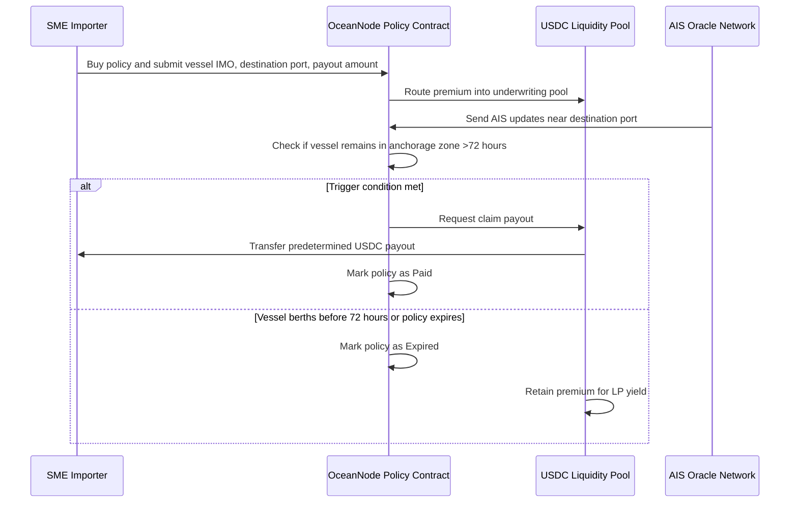

# Idea 1: Oracle-Driven Port Delay Payouts for SME Importers —— HE ZHILI

**1) Problem**

In global maritime logistics, small and medium-sized enterprise (SME) importers in Singapore who deal in time-sensitive, high-value perishable goods — such as pharmaceuticals, fresh produce, and premium food products — are particularly vulnerable to port congestion delays. When a vessel carrying their cargo is forced to wait at anchorage for extended periods, the consequences cascade rapidly: perishable inventory spoils, downstream delivery commitments to retailers and hospitals are breached, and working capital is trapped in goods that cannot be sold or used.

For example, during peak congestion events at major transshipment hubs like Singapore's PSA terminals or Port Klang in Malaysia, vessels have been reported to wait 3–7 days at anchorage before berthing. For an SME importer of temperature-sensitive pharmaceuticals or fresh produce, even a 72-hour delay can render an entire shipment commercially worthless.

However, traditional marine cargo insurance is poorly suited to address this specific risk. The claims process is designed for catastrophic physical losses (e.g., vessel sinking, container damage), not for the economic loss caused by delay-induced spoilage. If an SME files a delay-related claim, the insurer requires extensive documentation: original bills of lading, port authority delay certificates, surveyor reports on cargo condition, and proof of financial loss. The assessment process typically takes weeks to months, during which the SME must absorb the full financial impact. For many small importers operating on thin margins, this cash flow gap is existential — they may lack the liquidity to re-order replacement goods before receiving any insurance payout.

Furthermore, traditional delay coverage (if available at all) is often subject to complex policy exclusions and subjective adjuster interpretations, creating a fundamental trust gap between the insurer and the insured SME.

**2) Blockchain Solution**

A blockchain-based parametric insurance solution can fundamentally transform how port delay risk is managed for SME importers. The core innovation lies in replacing the subjective, manual claims process with an objective, automated smart contract triggered by real-time maritime data.

**Smart Contract Design:** The insurance policy is encoded as a smart contract deployed on a blockchain (e.g., Ethereum or a permissioned enterprise chain). The contract defines clear, objective parametric trigger conditions — for instance: "If vessel [IMO number] remains at anchorage within a 10 nautical mile radius of [designated port] for more than 72 consecutive hours, as verified by AIS data, a payout of [predefined amount in USDC/USDT] is automatically transferred to the policyholder's wallet."

**Decentralized Oracle Integration:** The critical trust layer is provided by decentralized oracles (such as Chainlink) that feed real-time AIS (Automatic Identification System) data on-chain. AIS is a global maritime tracking system mandated by the IMO (International Maritime Organization) for vessels above 300 gross tonnage. It provides continuous, tamper-evident vessel position, speed, and status data. By using multiple independent oracle nodes to aggregate and verify AIS data before feeding it to the smart contract, the system eliminates single points of failure and ensures data integrity.

**Atomic Payout Mechanism:** When the oracle-verified trigger condition is met, the smart contract automatically executes the payout in stablecoins (e.g., USDC) to the SME's digital wallet — without any human intervention, claims submission, or adjuster assessment. This provides the SME with instant liquidity, typically within minutes of the trigger being confirmed. The SME can immediately use these funds to re-order replacement inventory, arrange alternative airfreight, or cover operating expenses.

**Key Advantages over Traditional Insurance:**

- **Speed:** Payouts occur in near real-time (minutes) rather than weeks or months, providing immediate cash flow relief to SMEs.
- **Transparency:** The trigger conditions, vessel tracking data, and payout history are all recorded immutably on-chain, eliminating disputes over claim validity.
- **Cost Efficiency:** By removing manual claims processing, surveying, and adjuster costs, the operational overhead is drastically reduced, enabling lower premiums for SMEs.
- **Trustless Execution:** Neither the insurer nor the insured can dispute or block a valid payout — the smart contract executes deterministically based on objective data, bridging the "trust gap" inherent in traditional marine insurance.
- **Programmable Risk:** The smart contract parameters (delay threshold, coverage amount, geographic zone) can be customized per policy, enabling flexible, route-specific coverage that traditional insurers struggle to offer at scale.

This solution leverages Singapore's position as the world's busiest transshipment hub and a leading fintech center to demonstrate how blockchain-based parametric insurance can convert an opaque, slow financial process into a transparent, programmable, and instantly executable financial instrument — directly addressing the resilience gap faced by SMEs in global supply chains.

---

## 3) Alignment with the Final OceanNode Design

In the final Stage 4 design, Idea 1 is no longer presented as a standalone insurance product. It becomes **Trigger B** inside OceanNode's unified **Maritime Resilience Policy**:

- **Trigger A:** Pre-departure container roll-over, verified by carrier or port terminal APIs.
- **Trigger B:** Post-departure port congestion delay, verified by AIS maritime oracles.
- **Funding layer:** Payouts are not funded by a traditional insurer. They are funded by OceanNode's decentralized underwriting liquidity pool, where LPs stake USDC to underwrite maritime risk.

My module focuses on **Trigger B: AIS-verified port delay payouts**. The business purpose is to protect SME importers after the vessel has already departed but becomes stuck near the destination port. If the port delay exceeds the agreed parametric threshold, the smart contract automatically transfers stablecoin compensation from the liquidity pool to the SME.

---

## 4) Smart Contract / dApp Design: AIS-Triggered Port Delay Payout

### 4.1 Roles and Trust Assumptions

| Role | Function in OceanNode | Trust Assumption |
| --- | --- | --- |
| SME importer | Purchases the Maritime Resilience Policy and receives payout if the trigger is hit. | The SME must provide correct shipment details, wallet address, vessel IMO number, destination port, and cargo category. |
| Liquidity providers (LPs) | Stake USDC into the underwriting pool and earn premiums as yield. | LPs accept that their capital may be used for valid payouts. |
| AIS oracle network | Feeds verified vessel location, speed, destination, and anchorage status into the contract. | Multiple oracle nodes reduce single-source manipulation risk, but the system still depends on off-chain AIS data quality. |
| OceanNode smart contract | Stores policy parameters, evaluates oracle updates, and executes payout. | Contract logic must be audited because it controls pooled capital. |
| Pool / treasury contract | Holds USDC liquidity and releases payout when the policy contract confirms a valid trigger. | The pool must maintain enough collateral to support outstanding insured exposure. |

### 4.2 Policy State Transitions

| State | Meaning | Next Possible State |
| --- | --- | --- |
| `Quoted` | Premium is calculated based on route, cargo type, coverage amount, and delay threshold. | `Active` if SME pays premium. |
| `Active` | Policy is live and shipment is being monitored. | `MonitoringAtDestination`, `Expired`, or `Cancelled`. |
| `MonitoringAtDestination` | Vessel is near the destination port; AIS oracle starts counting anchorage time. | `Triggered` if delay exceeds threshold; `Expired` if vessel berths before threshold. |
| `Triggered` | Oracle confirms vessel stayed in anchorage zone for more than 72 consecutive hours. | `Paid` after USDC payout. |
| `Paid` | SME has received the predetermined payout. | Final state. |
| `Expired` | No valid delay trigger occurred before policy expiry. | Final state; premium remains with liquidity pool. |

### 4.3 Solidity-Style Pseudocode

```solidity
contract OceanNodePortDelayPolicy {
    enum PolicyState {
        Quoted,
        Active,
        MonitoringAtDestination,
        Triggered,
        Paid,
        Expired
    }

    struct Policy {
        address smeWallet;
        string vesselIMO;
        string destinationPort;
        uint256 premiumUSDC;
        uint256 payoutUSDC;
        uint256 delayThresholdHours;      // example: 72 hours
        uint256 anchorageRadiusNM;        // example: 10 nautical miles
        uint256 coverageExpiry;
        PolicyState state;
        uint256 anchorageStartTime;
    }

    mapping(uint256 => Policy) public policies;
    address public aisOracle;
    address public liquidityPool;
    IERC20 public usdc;

    function activatePolicy(uint256 policyId) external {
        Policy storage p = policies[policyId];
        require(p.state == PolicyState.Quoted, "Policy not quoted");
        require(msg.sender == p.smeWallet, "Only SME can activate");

        usdc.transferFrom(p.smeWallet, liquidityPool, p.premiumUSDC);
        p.state = PolicyState.Active;
    }

    function updateAISStatus(
        uint256 policyId,
        bool vesselInsideAnchorageZone,
        bool vesselHasBerthed,
        uint256 oracleTimestamp
    ) external {
        require(msg.sender == aisOracle, "Only AIS oracle");
        Policy storage p = policies[policyId];
        require(p.state == PolicyState.Active || p.state == PolicyState.MonitoringAtDestination, "Policy inactive");

        if (block.timestamp > p.coverageExpiry) {
            p.state = PolicyState.Expired;
            return;
        }

        if (vesselHasBerthed) {
            p.state = PolicyState.Expired;
            return;
        }

        if (vesselInsideAnchorageZone && p.anchorageStartTime == 0) {
            p.anchorageStartTime = oracleTimestamp;
            p.state = PolicyState.MonitoringAtDestination;
        }

        if (vesselInsideAnchorageZone && oracleTimestamp >= p.anchorageStartTime + p.delayThresholdHours * 1 hours) {
            p.state = PolicyState.Triggered;
            _executePayout(policyId);
        }
    }

    function _executePayout(uint256 policyId) internal {
        Policy storage p = policies[policyId];
        require(p.state == PolicyState.Triggered, "Trigger not confirmed");

        ILiquidityPool(liquidityPool).payClaim(p.smeWallet, p.payoutUSDC);
        p.state = PolicyState.Paid;
    }
}
```

This is not intended to be deployable production code. It is a clear business-logic structure showing the main conditions: policy activation, AIS oracle update, 72-hour anchorage threshold, expiry handling, and automatic payout from the liquidity pool.

### 4.4 Sequence Flow for Slides



### 4.5 Financial Consequences

For the SME, the payout provides immediate working capital when the shipment is delayed at the destination port. This can be used to reorder replacement inventory, arrange emergency logistics, or cover penalties from downstream customers. For LPs, the premium becomes yield if no trigger occurs, but their capital absorbs the payout if the insured event occurs. This makes the system economically similar to insurance underwriting, but with automated settlement and transparent on-chain accounting.

---

## 5) Digital Asset Choice and Comparison

### 5.1 Recommended Asset: USDC Stablecoin

OceanNode should denominate premiums and payouts in **USDC or another fully backed regulated stablecoin**. This is the best fit for SME insurance because the purpose of the product is risk hedging, not crypto speculation. SMEs need a payout whose value is predictable and usable for business expenses.

### 5.2 Comparison of Digital Asset Alternatives

| Asset Type | Advantages | Limitations | Suitability for OceanNode |
| --- | --- | --- | --- |
| USDC / fully backed stablecoin | Fast settlement, programmable, low volatility, widely supported in DeFi, suitable for premiums and payouts. | Issuer risk, reserve risk, potential freeze or compliance controls, stablecoin regulation risk. | Best current option for the prototype because it balances automation and price stability. |
| CBDC | Strong central bank backing and high trust if available. | Retail or wholesale CBDC access may be limited; not easily composable with DeFi liquidity pools today. | Good long-term institutional option, but less practical for a student project and early-stage DeFi protocol. |
| Deposit token / tokenized bank deposit | Bank-grade credit claim and potential regulatory comfort. | Requires bank participation, permissioned infrastructure, and limited availability. | Suitable for future enterprise version with banks and insurers. |
| Volatile crypto asset such as ETH | Native blockchain liquidity and decentralization. | Price volatility creates mismatch: payout value may fall exactly when SME needs certainty. | Not suitable for SME insurance payouts. |
| Platform token such as $NODE | Can support governance and liquidity incentives. | Volatile, speculative, and unsuitable as claim settlement asset. | Optional incentive layer only; should not be used for premiums or payouts. |

### 5.3 Main Risks of Using Stablecoins

- **Issuer and reserve risk:** If the stablecoin issuer faces reserve, banking, or redemption problems, the payout asset may lose credibility.
- **Depeg risk:** A stablecoin may temporarily trade below one US dollar during market stress.
- **Compliance risk:** Stablecoin transfers may require KYC/AML controls, especially for a Singapore-based insurance product.
- **Smart contract custody risk:** Premiums and underwriting capital held in the liquidity pool can be exposed to contract bugs.

Despite these risks, USDC remains the most appropriate digital asset for OceanNode because it supports automated smart contract settlement while keeping the insurance payout economically close to a fiat-denominated claim.

---

## 6) Slide Content for My Module

### Slide A: Financial Problem - Port Delay Risk for SME Importers

- SME importers of pharmaceuticals and fresh produce are exposed to port congestion delays.
- Traditional marine insurance is slow, document-heavy, and poorly suited for delay-induced spoilage.
- A 72-hour port delay can destroy cargo value and create immediate cash flow pressure.

### Slide B: OceanNode Solution - Trigger B inside the Unified Policy

- OceanNode offers one Maritime Resilience Policy covering roll-over risk and port delay risk.
- My module is Trigger B: AIS-verified destination port delay.
- If a vessel remains in the anchorage zone for more than 72 hours, the contract triggers an automatic USDC payout.

### Slide C: Smart Contract Logic

- SME activates policy by paying premium in USDC.
- AIS oracle monitors vessel location and anchorage duration.
- Contract checks objective conditions: vessel IMO, destination port, anchorage radius, delay threshold, policy expiry.
- If the trigger is valid, the contract requests payout from the liquidity pool.

### Slide D: Digital Asset Justification

- USDC is used for premiums and payouts because SMEs need stable value and fast liquidity.
- LPs stake USDC to underwrite risk and earn premium yield.
- $NODE, if used, should only be a governance or incentive token, not the claim settlement asset.

### Slide E: Key Risks and Mitigations

- Oracle risk: use multiple AIS data sources and oracle nodes.
- Stablecoin risk: prefer fully backed stablecoins and disclose issuer/depeg risk.
- Liquidity pool risk: cap insured exposure per pool and maintain collateral buffers.
- Regulatory risk: apply KYC/AML and align with MAS expectations for digital payment tokens and insurance distribution.
